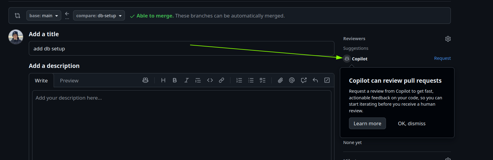
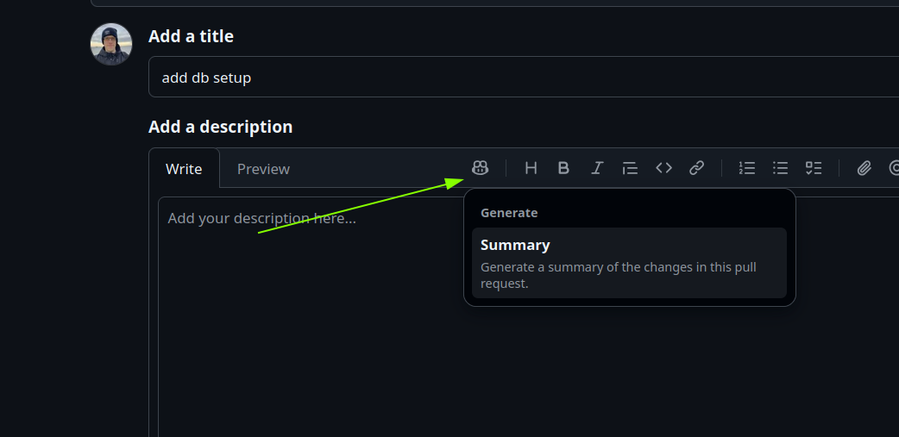

# Task
- Push the changes to your remote repository.
- Make a Pull Request (PR) for your changes.

- Request a code review from Copilot in the PR  
- Commit Suggestions made by Copilot in the PR or ignore its if not applicable
- Merge the PR once the review is complete.

# Tips and Tricks
- You can ask Copilot to generate a description of your changes 

