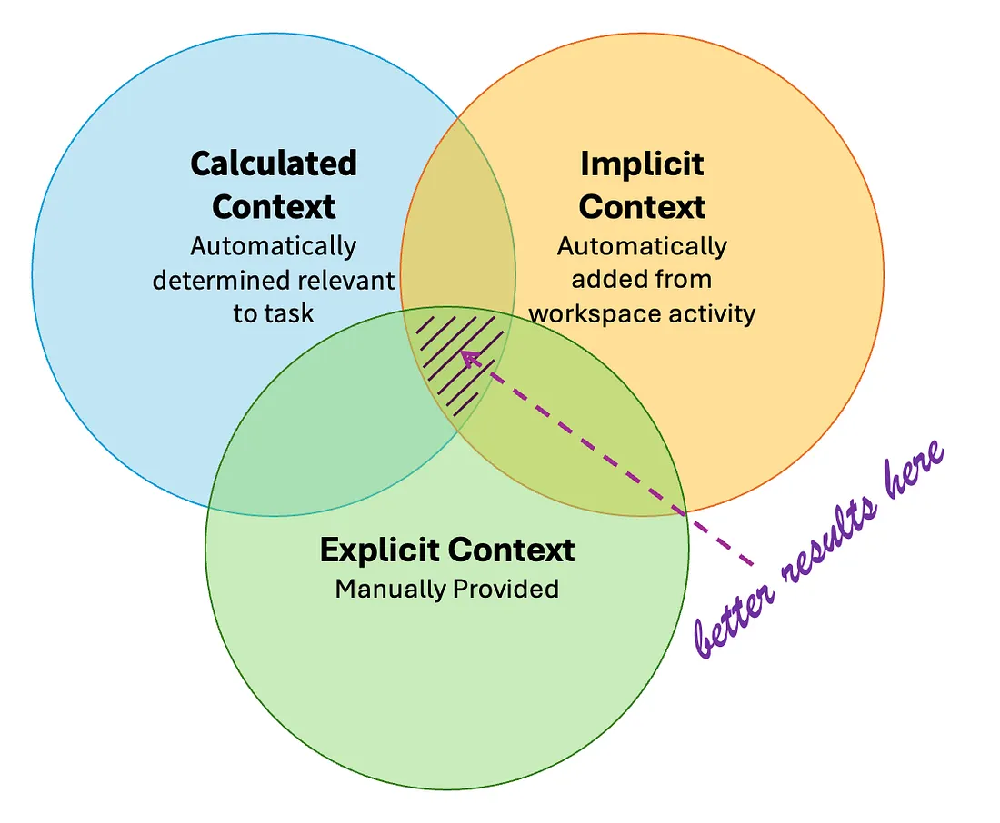

## Introduction
Copilot is only as good as the context you give it. The better the context, the fewer the iterations, and the more accurate the output. This tutorial is about understanding the different types of context Copilot can use and how to leverage them for better results. This time, we will focus only on the Theory part. You will be able to apply this knowledge in the following tutorials.

## Types of Context

Copilot is only as good as the context you give it. The better the context, the fewer the iterations, and the more accurate the output.

When working with Copilot, you’re always providing it with a mix of three types of context:

### Calculated Context
The context you get without lifting a finger. Copilot automatically scans your request, analyses your open files, and pulls in relevant code snippets. 

For example, when you use the `@workspace` command in the Copilot Chat window, Copilot analyses the user’s prompt and automatically selects relevant files from the workspace to provide the model with the necessary context.

### Explicit Context
You give information directly to Copilot, e.g. by selecting a text in the editor and typing `#selection` in the Copilot Chat window - or by adding a file via drag-and-drop. 

### Implicit Context
Last but not least is implicit context. Copilot picks up Implicit Context from simply watching what you’re doing in your workspace. It notices which file you have open, any text you’ve highlighted, and even other files you’ve got sitting in tabs. All of this is automatically factored into Copilot’s real-time suggestions.

 

## The context window

The context window (or “context length”) of a large language model (LLM) is the amount of text, in tokens, that the model can consider or “remember” at any one time. A larger context window enables an AI model to process longer inputs and incorporate a greater amount of information into each output.

An LLM’s context window can be thought of as the equivalent of its working memory. It determines how long of a conversation it can carry out without forgetting details from earlier in the exchange. It also determines the maximum size of documents or code samples that it can process at once. When a prompt, conversation, document or code base exceeds an artificial intelligence model’s context window, it must be truncated or summarized for the model to proceed. 

The number of tokens that an LLM can handle in its context window can be found under: https://models.dev. 

## Best practices

### Open relevant files 

Having your files open provides GitHub Copilot with context. When you have additional files open, it will help to inform the suggestion that is returned

### Use `#selection` and `#terminalSelection`

When you highlight text in your editor or terminal and use the `#selection` or `#terminalSelection` commands in Copilot Chat, you are providing explicit context to Copilot. This helps it understand exactly what part of your code or terminal output you want it to focus on. You can also use these multiple times in a single prompt. The `#selection` command automatically gets replaced by the filename and line numbers of the selected text and therefore can be used multiple times in a single prompt.

### Start new conversations when previous context is not relevant
If you are switching to a different topic or task, it’s best to start a new conversation in Copilot Chat. This ensures that the model doesn’t get confused by previous context that is no longer relevant.

## References
- [The Secret Weapon for Better GitHub Copilot Results — Context](https://medium.com/versent-tech-blog/the-secret-weapon-for-better-github-copilot-results-context-5d9356a31cc4)

- [How to use GitHub Copilot in your IDE: Tips, tricks, and best practices](https://github.blog/developer-skills/github/how-to-use-github-copilot-in-your-ide-tips-tricks-and-best-practices/)

- [ What is a context window?](https://www.ibm.com/think/topics/context-window)