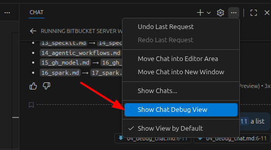

# Introduction
You can get more insights of your requests by using the VSCode Chat Debug View. 

The Chat Debug view shows the following information for each interaction:

- The system prompt that sets up the AI's behavior
- The user prompt that you submitted
- The context that is sent to the language model
- The detailed response from the language model
- Responses from tools that are invoked as part of the chat request

# Tutorial
- Open the  
- Inspect your chat requests and responses in detail.

# References
- [Debugging Chat Requests](https://code.visualstudio.com/docs/copilot/chat/chat-debug-view)